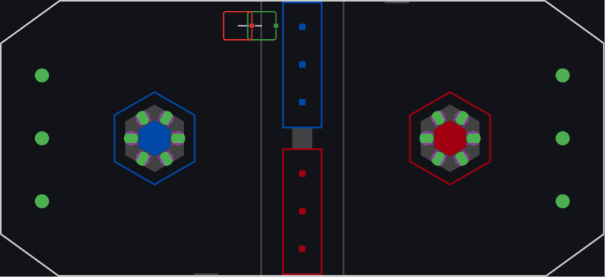
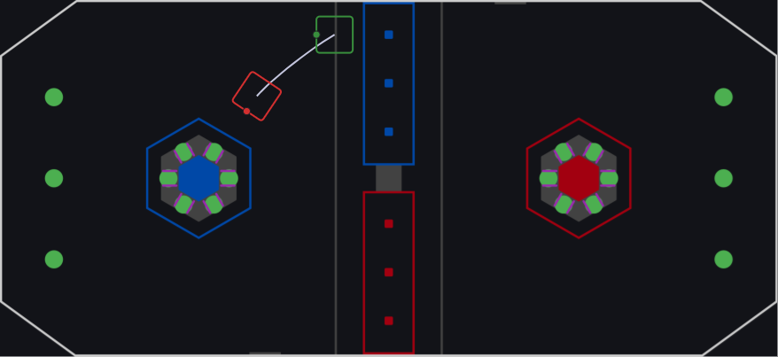
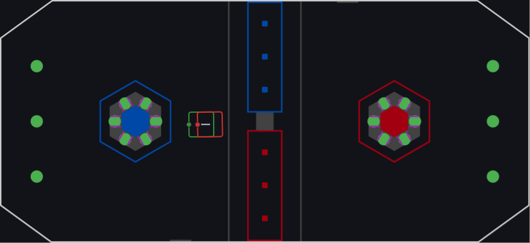
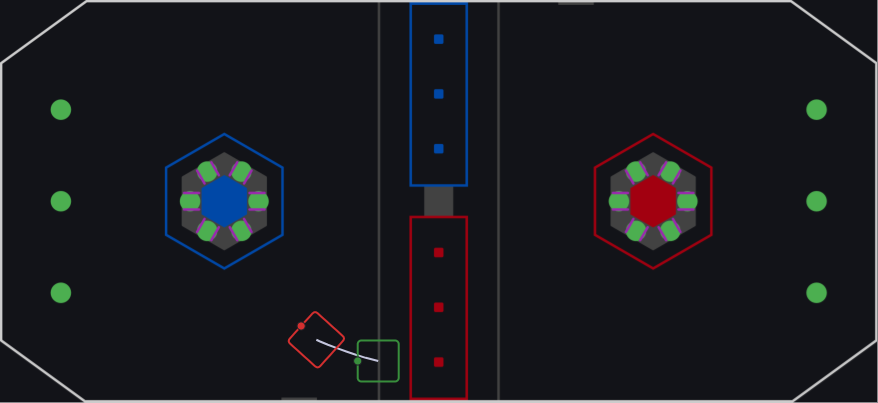

# Docs

All the fancy quick reference stuff goes here.

## Autonomous

### Auto Routines

1. Short Leave (works anywhere on the field)

2. Score L2 Blue (align half way between far and center cage on blue side)

3. Score L4 Center (align on center left coral)

4. Score L2 Red (align center red cage)

## Controls

### Teleop

#### Xbox Controller (Driver) [`Port 0`]

| Binding         | Action | Description |
| --------------- | ------ | ----------- |
| `Button A`      | Zero gyro | Resets gyro heading |
| `Button X`      | Auto Target left Reef  | automatically target and drive to left reef; will rumble if further than 1.5m  |
| `Button B`      | Auto Target right Reef | automatically target and drive to right reef; will rumble if further than 1.5m |
| `Button Y`      | kill auto drive | restores manual control to the drive system |
| `Left Bumper`   | Lock drive | Locks drivebase |
| `Right Trigger` | Play music | Climber plays the duck song |
| `Right Bumper`  | Toggle robot relative  | Switches between field and robot relative driving |

#### Left Joystick (Operator) [`Port 1`]

| Binding                | Action              | Description                                     |
| ---------------------- | ------------------- | ----------------------------------------------- |
| `Trigger`              | Auto Intake / Eject | Based on coral sensor                           |
| `Trigger` & `Button 7` | Eject Coral         | Manual mode overrides coral sensor              |
| `Trigger` & `Button 8` | Intake Coral        | Manual mode overrides coral sensor              |
| `Button 2`             | Manual elevator     | Controls elevator speed manually                |
| `Button 5` on cluster  | Coral station       | Moves elevator and tilt to coral station height |
| `Button 3` on cluster  | L2 position         | Moves elevator and tilt to L2 height            |
| `Button 4` on cluster  | L3 position         | Moves elevator and tilt to L3 height            |
| `Button 6` on cluster  | L4 position         | Moves elevator and tilt to L4 height            |
| `Button 9`             | Climber descend     | Controls climber down                           |
| `Button 10`            | Climber climb       | Controls climber up                             |
| `Button 11`            | Manual tilt         | Control the tilt with the joystick              |
| `Button 12`            | Zero tilt encoder   | Sets the encoder to zero                        |

### Test Mode

> **Note:** In test mode, all tilt position limits are ignored to allow for full range of motion during testing and calibration.
>
> **Warning:** Avoid creating duplicate bindings for the same button in test mode. Any changes to these bindings should be documented here and in the code comments.

#### Xbox Controller (Driver)

| Binding         | Action          | Description                            |
| --------------- | --------------- | -------------------------------------- |
| `A Button`      | Zero gyro       | Resets gyro heading                    |
| `X Button`      | Auto Target     | Auto-targets the left reef             |
| `B Button`      | Auto Target     | Auto-targets the right reef            |
| `Y Button`      | cancel align    | Escape auto drive to pose              |
| `Back Button`   | Center modules  | Centers swerve modules                 |
| `Left Bumper`   | Play music      | Plays duck song                        |
| `Right Bumper`  | Run intake      | Runs the intake mechanism              |

#### Left Joystick (Operator) - Test Mode

| Binding     | Action             | Description                       |
| ----------- | ------------------ | --------------------------------- |
| `Trigger`   | Manual elevator    | Controls elevator speed manually  |
| `Button 3`  | lvl 4              | Sets elevator to level 4          |
| `Button 7`  | Demo mode          | Cycles through elevator positions |
| `Button 8`  | Tilt to position 0 | Resets tilt to zero position      |
| `Button 9`  | Descend            | Controls climber down             |
| `Joystick`  | Tilt               | Nudges tilt up/down (no limits in test mode) |
| `Button 12` | zero tilt encoder  | zeros tilt encoder                |
| `Button 2`  | Tilt SysID         | Runs tilt system identification   |

#### Right Joystick (Operator) [`Port 2`]

| Binding     | Action            | Description                                   |
| ----------- | ----------------- | --------------------------------------------- |
| `Button 9`  | Elevator SysID    | Runs elevator system identification           |
| `Button 10` | Tilt SysID        | Runs tilt system identification               |
| `Button 11` | Angle motor SysID | Runs swerve angle motor system identification |
| `Button 12` | Drive motor SysID | Runs swerve drive motor system identification |

## CAN IDs

| Component        | Location    | ID   |
| ---------------- | ----------- | ---- |
| Drive Motor      | Front Right | `12` |
| Drive Motor      | Front Left  | `13` |
| Drive Motor      | Back Right  | `14` |
| Drive Motor      | Back Left   | `15` |
|                  |             |
| Turn Motor       | Front Right | `16` |
| Turn Motor       | Front Left  | `17` |
| Turn Motor       | Back Right  | `18` |
| Turn Motor       | Back Left   | `19` |
|                  |             |
| CanCoder         | Front Right | `20` |
| CanCoder         | Front Left  | `21` |
| CanCoder         | Back Right  | `22` |
| CanCoder         | Back Left   | `23` |
|                  |             |
| Score Motor      | 1           | `24` |
| Score Motor      | 2           | `25` |
| Score Tilt Motor | -           | `28` |
|                  |             |
| Elevator Motor   | Left        | `26` |
| Elevator Motor   | Right       | `27` |
|                  |             |
| Climber Motor    | Beefy       | `29` |

## DIO Constants

| Sensor                    | Port |
| ------------------------- | ---- |
| Coral Sensor              | `1`  |
| Elevator Encoder Left     | `2`  |
| Elevator Encoder Right    | `3`  |
| Homing Tilt Clicky Switch | `4`  |
